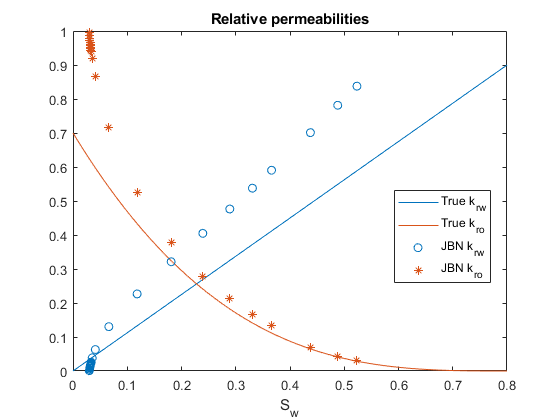

# Implementation of the Johnson–Bossler–Naumann (JBN) method   

## Estimating the two-phase relative permeabilities from unsteady-state core flooding data

 
This repository contains supplementary materials to the paper[^fn1] for setting up and running a core flooding simulation using [MRST](https://www.sintef.no/projectweb/mrst/), estimating the relative permeabilities with the JBN method[^fn2], and for comparing the results with the groud truth data.

## Dependencies

The forward simulation model has been tested with MRST 2023a and 2023b.

## References

[^fn1]: Andrianov, N., Mohammadkhani, S., Rostami, B., and Al-Masri, W. "Intermittent injection of supercritical CO2 in oil-brine-saturated rocks: Experimental data and numerical modelling" (under revision, 2024).

[^fn2]: Johnson, E.F., Bossler, D.P., and Naumann, V.O. "Calculation of Relative Permeability from Displacement Experiments." Trans. 216 (1959): 370–372. doi: https://doi.org/10.2118/1023-G.
